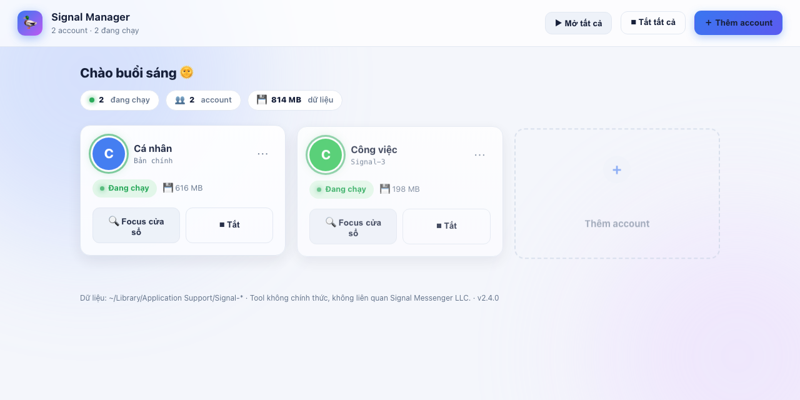

# Signal Manager 🦆

**Dùng 2, 3, 5… tài khoản Signal cùng lúc trên một máy Mac — có bảng điều khiển đẹp, bấm là chạy.**

👉 **Trang cài đặt 1-click (tự nhận Mac/Windows):** https://dev-lo-18tuoi.github.io/multi-signal/

<p align="center">
  
</p>

Bình thường Signal trên máy tính chỉ cho đăng nhập **một** tài khoản. Cài tool này xong, mỗi tài khoản có một cửa sổ Signal riêng, chạy song song, không đụng nhau.

---

## 🧰 Bạn cần gì trước khi cài? (đọc kỹ 3 dòng này)

1. Một máy **Mac** đã cài **[Signal Desktop](https://signal.org/download)** (miễn phí)
2. Mỗi tài khoản Signal = **một số điện thoại riêng**, và số đó **đã đăng ký Signal trên một chiếc điện thoại** — vì bản máy tính hoạt động bằng cách *quét mã QR từ điện thoại*
3. 5 phút rảnh ☕️

> ❗️Không có cách nào tạo 2 tài khoản từ 1 số điện thoại — đó là quy định của Signal, không tool nào làm khác được.

## 📦 Cài đặt (làm theo y hệt, không cần hiểu)

**Bước 1.** Nhấn tổ hợp phím `⌘ + phím cách` (Command + Space) → gõ chữ `Terminal` → nhấn `Enter`. Một cửa sổ chữ trắng nền sáng (hoặc đen) hiện ra — đừng sợ nó 😄

**Bước 2.** Copy nguyên dòng dưới đây (bấm nút 📋 ở góc phải khung), dán vào cửa sổ đó, nhấn `Enter`:

```bash
curl -fsSL https://raw.githubusercontent.com/dev-lo-18tuoi/multi-signal/main/install.sh | bash
```

**Bước 3.** Chờ đến khi thấy dòng **"✅ Cài xong!"** — app **Signal Manager** (icon con vịt vàng 🦆) sẽ tự mở. Xong! Có thể đóng Terminal, cả đời không cần mở lại.

> 💡 Kéo icon con vịt vào **thanh Dock** (thanh icon dưới màn hình) để lần sau bấm 1 phát là mở.

## ➕ Thêm tài khoản thứ 2 (và 3, 4…)

1. Trong app, bấm nút xanh **＋ Thêm account** → đặt tên gợi nhớ (vd: `congviec`) → **Tạo account**
2. Một cửa sổ Signal mới hiện ra kèm **mã QR**
3. Cầm chiếc điện thoại đang giữ số của tài khoản đó, mở Signal:
   **Cài đặt → Thiết bị đã liên kết → Liên kết thiết bị mới** → quét mã QR
4. Chờ vài phút để tin nhắn đồng bộ về. Xong!

## 🕹 Dùng hằng ngày

| Muốn | Bấm |
|---|---|
| Mở hết tài khoản (sáng vào làm) | **▶ Mở tất cả** |
| Nhảy tới cửa sổ của 1 tài khoản | **🔍 Focus cửa sổ** trên thẻ đó |
| Tắt 1 tài khoản / tắt hết | **⏹ Tắt** trên thẻ / **⏹ Tắt tất cả** |
| Tài khoản tự bật mỗi lần mở máy | menu **⋯** trên thẻ → **⚡ Tự mở khi bật máy** |
| Đặt tên & màu dễ nhớ cho thẻ | menu **⋯** → **✏️ Đổi tên** / **🎨 Đổi màu** |
| Xóa 1 tài khoản khỏi máy | menu **⋯** → **🗑 Xóa account…** (có hỏi kỹ trước khi xóa) |

Ngoài app quản lý, mỗi tài khoản còn có **icon riêng** trong thư mục `~/Applications` (icon vuông có màu + tên) — bấm thẳng vào đó cũng mở được, không cần qua app quản lý.

## ❓ Câu hỏi thường gặp

**Cửa sổ Signal tự nhiên biến mất?**
Signal vừa tự cập nhật phiên bản (2 tuần/lần). Mở lại bằng app quản lý hoặc icon — tin nhắn còn nguyên, không mất gì.

**Signal hiện banner vàng "Cannot Update" / "Không thể cập nhật"?**
Do nhiều cửa sổ Signal cùng chạy nên các trình cập nhật giẫm chân nhau. **Từ v2.9.0 tool
TỰ XỬ LÝ** — cứ để yên, trong vòng ~10 phút bạn sẽ thấy thông báo "đang tự cập nhật",
các cửa sổ tạm đóng ~1–2 phút rồi tự mở lại với bản Signal mới. Không cần làm gì cả.

Muốn xử tay cho nhanh (hoặc đang dùng bản cũ): bấm **⏹ Tắt tất cả** → chờ ~1 phút →
**▶ Mở tất cả**. Nếu vẫn kẹt, dán vào Terminal rồi lặp lại các bước trên:

```bash
rm -rf "$HOME/Library/Caches/org.whispersystems.signal-desktop.ShipIt"
```

**Không có tiếng "ting" khi tin nhắn tới?**
Âm thanh cần bật ở **2 tầng**: ① *System Settings → Notifications → Signal* → Allow + tick "Play sound for notification"; ② **trong từng cửa sổ Signal** nhấn `⌘ + ,` → Notifications → bật + tick "Play audio notification" (mỗi tài khoản một cài đặt riêng!). Lưu ý: cửa sổ đang mở trước mặt thì Signal cố tình không kêu, và Focus/Do Not Disturb 🌙 đang bật cũng câm.

**Máy hỏi mật khẩu khi mở Signal?**
Đó là macOS hỏi quyền đọc khóa bảo mật. Nhập mật khẩu máy rồi bấm **"Always Allow" (Luôn cho phép)** — nhớ chọn Always, chỉ bị hỏi 1 lần đầu cho mỗi tài khoản.

**Muốn lên bản mới của tool?**
Khi có bản mới, trong app sẽ hiện nút **🔄 Cập nhật** — bấm 1 phát là xong. (Hoặc chạy lại đúng lệnh cài ở trên, kết quả y hệt.)

**Xóa tài khoản trên máy có mất tin nhắn không?**
Không — chỉ xóa dữ liệu trên máy Mac này. Tin nhắn trên điện thoại còn nguyên. Nhớ vào điện thoại gỡ thiết bị cũ: *Cài đặt → Thiết bị đã liên kết*.

**Tool này có an toàn không?**
Toàn bộ chạy **trong máy bạn**, không gửi bất cứ thứ gì ra ngoài. Mã nguồn mở 100% tại repo này — ai cũng kiểm tra được từng dòng. App được tạo ngay trên máy bạn nên macOS không cảnh báo "nhà phát triển không xác định".

**Tìm lại app sau khi tắt máy?**
`⌘ + phím cách` → gõ "Signal Manager" → Enter. Hoặc Launchpad. Hoặc Dock nếu đã ghim.

## 🗑 Gỡ cài đặt

Dán vào Terminal:

```bash
"$HOME/Applications/Signal Manager.app/Contents/Resources/signal-manager.sh" uninstall
```

Chỉ gỡ tool — dữ liệu các tài khoản Signal giữ nguyên.

---

<details>
<summary><b>🔧 Phần cho người kỹ thuật (bấm để mở)</b></summary>

### Cách hoạt động

Mỗi account = 1 thư mục dữ liệu riêng tại `~/Library/Application Support/Signal-<tên>`, chạy qua flag `--user-data-dir` mà Electron/Signal hỗ trợ sẵn. Khóa single-instance nằm trong từng thư mục → các instance chạy song song. App quản lý = cửa sổ native Swift (WKWebView, compile cục bộ lúc cài bằng swiftc) + server Python stdlib bind `127.0.0.1` với token phiên + engine bash. Zero dependency ngoài.

### CLI

```text
signal-manager.sh list | state [--fast] | add <tên> | open <tên>|all|default
                  quit <tên>|all|default | autostart <tên> on|off
                  remove <tên> [--yes] | launcher <tên> | install | uninstall
```

### Homebrew

```bash
brew install dev-lo-18tuoi/signal-manager/signal-manager
signal-manager install
```

### Windows (BETA — chưa test máy thật, cần feedback)

```powershell
irm https://raw.githubusercontent.com/dev-lo-18tuoi/multi-signal/main/install-windows.ps1 | iex
```

CLI PowerShell: `add / open / quit / list / autostart / remove` + shortcut Desktop + autostart qua registry Run. Dashboard sẽ lên Windows sau.

### Bảo mật & giới hạn

- Profile chứa khóa + tin nhắn giải mã cục bộ — bảo vệ như chính máy của bạn, đừng sync thư mục `Signal-*` lên cloud
- Không copy profile sang máy khác (khóa gắn Keychain từng máy)
- Server chỉ bind loopback, mọi API cần token phiên (so sánh constant-time), check Host header
- Linux: chưa hỗ trợ chính thức (dùng được engine với chỉnh nhỏ — PR welcome)

### English summary

Run multiple Signal Desktop accounts side-by-side on one Mac. Each account gets its own data dir via Electron's `--user-data-dir`; a native Swift window hosts a local dashboard (127.0.0.1 + session token, zero external calls): open/focus/quit, QR-guided add, per-account login autostart, colored icons & nicknames, safe delete, one-click self-update. One-command install builds the app locally — no Gatekeeper warnings. Each account needs its own phone number registered in Signal on a phone (Signal's architecture).

### Credits & prior art

[kmille/signal-account-switcher](https://github.com/kmille/signal-account-switcher) ·
[phx/signal-multi-account](https://github.com/phx/signal-multi-account) ·
[blanchardjeremy/signal-multiple-desktop-mac](https://github.com/blanchardjeremy/signal-multiple-desktop-mac).
Viết mới hoàn toàn (clean-room), tập trung UX + an toàn.

</details>

## Giấy phép & miễn trừ

MIT License — xem [LICENSE](LICENSE). Dự án không chính thức, không liên kết với
Signal Messenger LLC / Signal Foundation. "Signal" là nhãn hiệu của Signal Messenger LLC.
